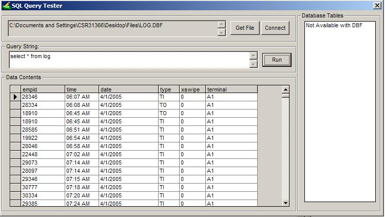



## A sql query execution program

### Description

An application that allows you to open a Microsoft Access or Foxpro Database and then run/execute sql queries through them. uses ADO,datagrid and common dialog box. Please vote! tnX! =)
 
### More Info
 

             |
---                |---
**Submitted On**   |2006-08-16 17:16:20
**By**             |[Carlo Rodriguez](https://github.com/Planet-Source-Code/PSCIndex/blob/master/ByAuthor/carlo-rodriguez.md)
**Level**          |Advanced
**User Rating**    |4.4 (48 globes from 11 users)
**Compatibility**  |VB 6\.0
**Category**       |[Databases/ Data Access/ DAO/ ADO](https://github.com/Planet-Source-Code/PSCIndex/blob/master/ByCategory/databases-data-access-dao-ado__1-6.md)
**World**          |[Visual Basic](https://github.com/Planet-Source-Code/PSCIndex/blob/master/ByWorld/visual-basic.md)
**Archive File**   |[A\_sql\_quer2013808162006\.zip](https://github.com/Planet-Source-Code/carlo-rodriguez-a-sql-query-execution-program__1-66286/archive/master.zip)

